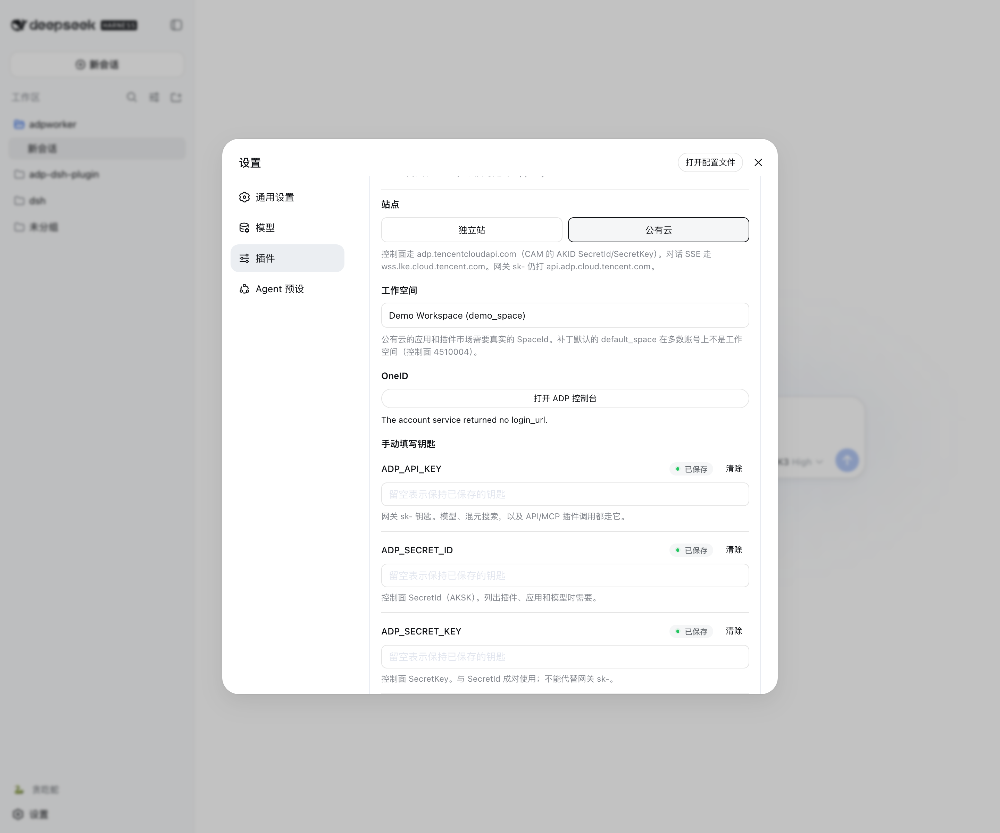
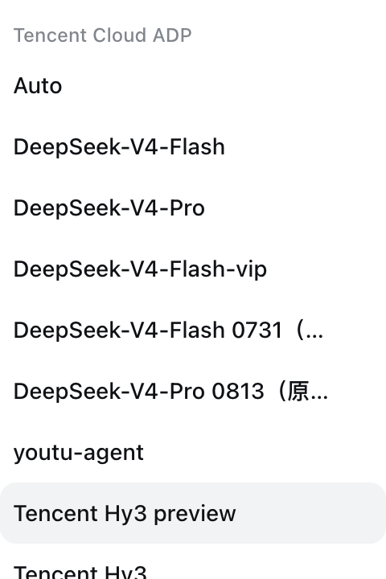

# @tencent/dsh-adp

把腾讯云 ADP 接到 [DeepSeek Harness](https://github.com/deepseek-ai/deepseek-harness) 的插件包。

[](LICENSE.txt)
[](https://nodejs.org)
[](https://pnpm.io)
[](https://github.com/TencentCloudADP/Tencent-ADP-dsh-plugin)

[English](README.md) · [中文](README.zh-CN.md)

这个插件把一个 DSH profile 接到腾讯云 ADP：网关模型（混元等）、混元 AI 搜索、API/MCP 插件市场、技能广场，以及把 ADP 应用注册成 ask 工具。不是 ADP Worker。

## 安装

```sh
git clone https://github.com/TencentCloudADP/Tencent-ADP-dsh-plugin.git
cd Tencent-ADP-dsh-plugin
dsh plugin --profile web add .
# 或安装打好的 tarball：dsh plugin --profile web add ./tencent-dsh-adp-0.1.0.tgz
dsh web
```

装好后到 设置 → 插件配置 → **腾讯云 ADP** 填凭证（见下节）。装不上、装过旧名字、或 pnpm 拦住构建的，见 [docs/pitfalls.md](docs/pitfalls.md#install)。

## 配置：独立站 / 公有云

ADP 需要三类凭证。配置里只写**引用名**（`ADP_API_KEY` 等）；实际值放在 `$DSH_HOME/.credentials.yaml` 或环境变量。

官方 API 文档覆盖的是**控制面 AKSK**和**AppKey SSE 对话**。本插件还用一条 OpenAI 形态的模型网关，官方概览没有写这条。端点和密钥出处见 [API 概览](https://cloud.tencent.com/document/product/1759/133868)。平面和报错见 [docs/credentials.md](docs/credentials.md)。




| 平面                   | 引用名                                | 官方出处                                                                                                                                              | 缺失时                                       |
| -------------------- | ---------------------------------- | ------------------------------------------------------------------------------------------------------------------------------------------------- | ----------------------------------------- |
| 网关 `sk-`             | `ADP_API_KEY`                      | [133868](https://cloud.tencent.com/document/product/1759/133868) 未写；与 adpworker 相同，走 `api.adp.cloud.tencent.com`                                  | LLM / 搜索 / 插件**调用**报 `MISSING_CREDENTIAL` |
| SecretId / SecretKey | `ADP_SECRET_ID` / `ADP_SECRET_KEY` | 公有云：[CAM 访问密钥](https://cloud.tencent.com/document/product/598/40488)。独立站：ADP 控制台 **密钥管理**                                                         | 模型 / 插件 / 应用**目录**为空                      |
| 按应用的 AppKey          | 例如 `ADP_APP_KEY_DEMO`              | [应用发布 → API 管理](https://cloud.tencent.com/document/product/1759/104209) 或应用 **调用**（[SSE](https://cloud.tencent.com/document/product/1759/105561)） | 对应的 ask 工具不会注册                            |


### 1. 开通 ADP

注册腾讯云并完成实名认证，再打开产品（[产品概述](https://cloud.tencent.com/document/product/1759/104193)）。主账号首次登录会自动建一个企业和一个**默认工作空间**；那个空间的 id **不是**补丁里的字符串 `default_space`（[企业、工作空间与权限概述](https://cloud.tencent.com/document/product/1759/122569)）。


| 站点      | 控制台                                                    | 控制面                       | 对话 SSE                                          |
| ------- | ------------------------------------------------------ | ------------------------- | ----------------------------------------------- |
| **独立站** | [adp.tencent.com](https://adp.tencent.com)             | `capi.adp.tencent.com`    | `https://adp.tencent.com/adp/v2/chat`           |
| **公有云** | [adp.cloud.tencent.com](https://adp.cloud.tencent.com) | `adp.tencentcloudapi.com` | `https://wss.lke.cloud.tencent.com/adp/v2/chat` |


两边的模型补全都打 `https://api.adp.cloud.tencent.com/chat/completions`（不要加 `/v1`）。没有 `api.adp.tencent.com`。

### 2. 拿 SecretId / SecretKey

**公有云** — CAM 的 `AKID…` 密钥（36 位）：

1. 打开 [访问管理 → API 密钥管理](https://console.cloud.tencent.com/cam/capi)。
2. 没有密钥就新建（[主账号访问密钥管理](https://cloud.tencent.com/document/product/598/40488)）。立刻复制 **SecretId** 和 **SecretKey**；2023-11-30 之后新建的密钥只在创建时展示 SecretKey。
3. 子账号需要在 CAM 角色里开通智能体开发平台（原大模型知识引擎）读写权限（[技术常见问题](https://cloud.tencent.com/document/product/1759/109469)）。协作者账号不能用（[122569](https://cloud.tencent.com/document/product/1759/122569)）。

**独立站** — ADP 控制台密钥（约 26 位，**不是** `AKID`）：

1. 登录 [adp.tencent.com](https://adp.tencent.com)。
2. 打开 **密钥管理**，复制 SecretId / SecretKey（[API 概览 · 独立站](https://cloud.tencent.com/document/product/1759/133868)）。

这对密钥只签控制面（`DescribeModelList`、`DescribeSpaceList`、市场目录）。它不是 `ADP_API_KEY`。

### 3. 拿网关 `sk-`（`ADP_API_KEY`）

准备一个能通过 `POST https://api.adp.cloud.tencent.com/chat/completions` 鉴权的 API Key（一般以 `sk-` 开头）。混元 / DeepSeek 补全、混元搜索、API/MCP 插件 HTTP 都用它。独立站控制台的 AKSK 不能替代它。

### 4. 可选：AppKey

只给 `adp_ask` / `adp_ask_<slug>`（对已发布应用做 SSE），选 `adp:Hunyuan/hy3` 不需要它。

1. 先发布应用。
2. 打开 **应用发布 → 服务状态 → API 管理**，或 **应用管理 → 调用**，复制 AppKey（[104209](https://cloud.tencent.com/document/product/1759/104209)、[105560](https://cloud.tencent.com/document/product/1759/105560)）。


### 5. 填到 DSH 卡片

1. 在本机回环地址跑 `dsh web`（`127.0.0.1`）。只有回环地址允许写入凭证。
2. 设置 → 插件配置 → **腾讯云 ADP**。
3. 选 **独立站** 或 **公有云**。
4. 贴上 SecretId / SecretKey（以及网关 `sk-`），保存。值经 `credentials.set` 写入 `$DSH_HOME/.credentials.yaml`。
5. AKSK 存上之后，卡片用 `DescribeSpaceList` 拉工作空间列表，选一个。公有云的应用和插件调用需要真实 **SpaceId**；补丁默认的 `default_space` 在多数账号上不是工作空间（控制面 `4510004`）。列表为空时，从 ADP 控制台把 SpaceId 贴进去（[工作空间](https://cloud.tencent.com/document/product/1759/122576)）。
6. 要用 ask 工具再贴 AppKey，再保存一次。

卡片上的 OneID 会新开标签页打开 ADP 控制台，**不会**写入任何凭证。

纯 API 从零搭 Claw 应用（CreateSpace → CreateApp → CreateAgent → CreateRelease → 对话）见 [133869](https://cloud.tencent.com/document/product/1759/133869)。那条链路是 AppKey SSE，不是本插件的网关 adapter。

## 装上即用

`adp-core`、`llm-adp`、`web-adp`、`plugins-adp`、`skills-adp`、`agents-adp`、`control-adp` 随插件启动：



- 选 `adp:Hunyuan/hy3`（或其他网关模型），完成一轮带工具调用的对话。目录和补全怎么接：[docs/seams.md](docs/seams.md#how-models-work-llm-adp)。
- 当前 provider 选中时，`web_search` 走混元 AI 搜索（偏国内索引）。
- 用 `adp_plugin_list` / `adp_plugin_enable` 或 `enabledPluginIds` 打开市场里的 API / MCP 插件。公有云的应用和插件调用需要先选好工作空间。
- 生成类媒体链接（COS，约 24 小时过期）会落到工作区 `saved_files`。
- 技能广场作为 `ctx.skills` provider（没有下载 URL 的条目只出现在 `list`）。
- `adp_provision_agent` — CreateApp → CreateAgent → CreateRelease → FieldMask 取 AppKey → `adp_ask_<slug>`。
- `adp_ask` / `adp_ask_<slug>` — SSE 问答；不是 DSH 子 agent。
- `adp_list_actions` / `adp_call`，配合 `allowMutating` 做 App/Agent/Release 的增删改。会改控制面的调用需要审批。


## 文档

- [docs/credentials.md](docs/credentials.md) — 每类凭证从哪来，缺了会坏什么
- [docs/seams.md](docs/seams.md) — 本插件与 DSH 之间的对接约定
- [docs/pitfalls.md](docs/pitfalls.md) — 踩过的坑
- [docs/verification.md](docs/verification.md) — 手工验证清单


## 验证

```sh
pnpm test         # 模拟 HTTP；不需要密钥；CI 门禁
pnpm test:live    # 真实账号；环境变量缺失则跳过
```


## 贡献

欢迎在 [GitHub](https://github.com/TencentCloudADP/Tencent-ADP-dsh-plugin) 提 Issue 和 PR。提 PR 前先跑一遍 `pnpm test`。

## 许可证

MIT。Copyright (C) 2026 Tencent。正文和第三方声明见 [LICENSE.txt](LICENSE.txt)（`eventsource-parser`、`fflate`）。
